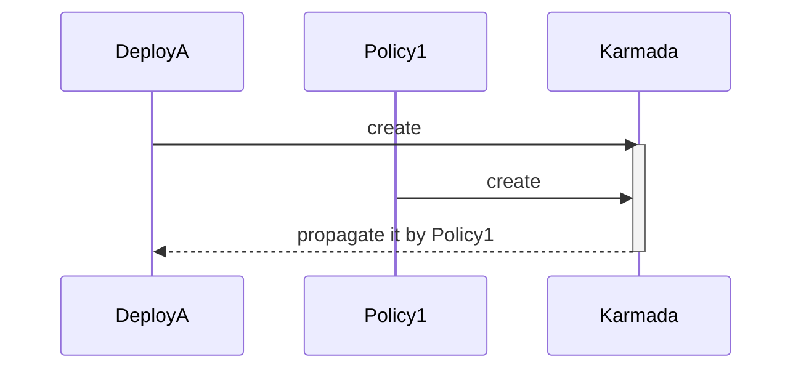
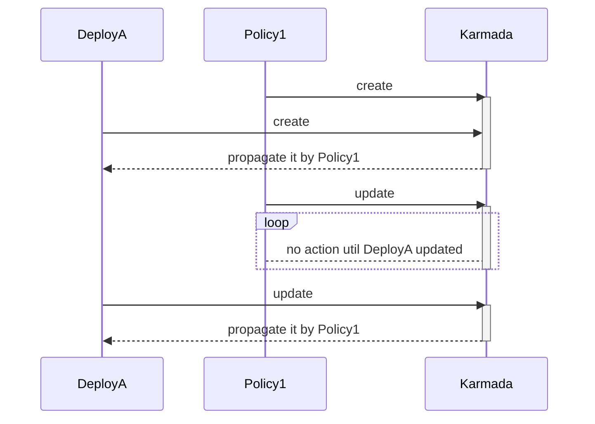
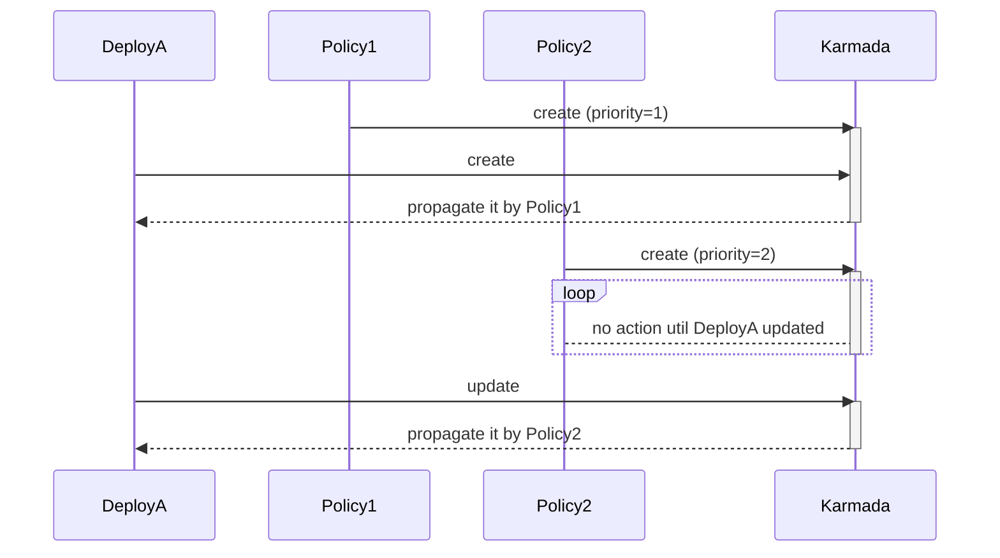
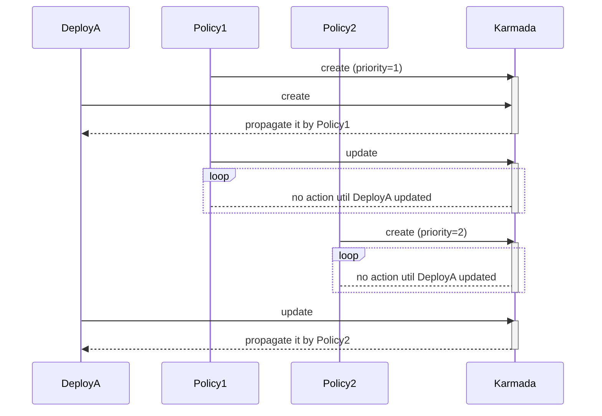
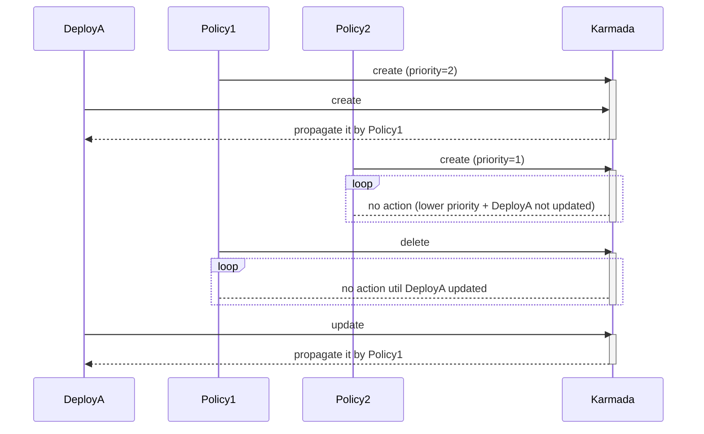
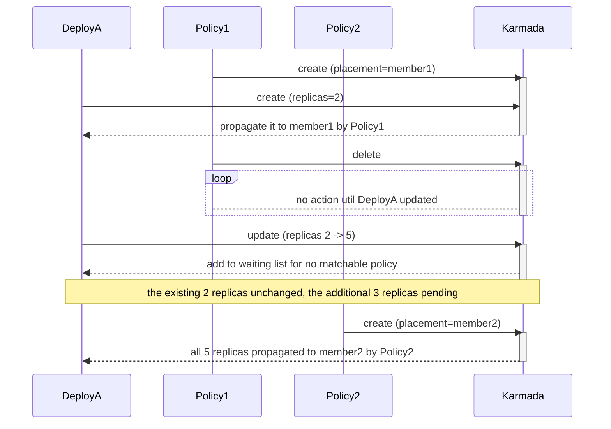

# Statization of Propagation Policy

## Summary

In this paper, we propose an improvement to the Policy enforcement mechanism, called Policy Staticization.
Before the introduction of this feature, modification of a Policy would immediately affect the ResourceTemplate it manages, 
potentially causing a huge shock to the system, which is too sensitive.

We want Policy to be just some API-based static system strategies. Modification of the Policy should not actively cause changes to the system behavior, 
but should be triggered by ResourceTemplate. Just like if a ResourceTemplate has already been propagated by a Policy, don't change its states for any Policy changes,
but you can re-propagate it by latest Policy when ResourceTemplate itself updated.

So, I propose to staticize the PropagationPolicy/ClusterPropagationPolicy as:

* If a ResourceTemplate is not managed by a Policy, when there is a matching Policy in the system,
  the ResourceTemplate will be distributed according to the Policy with the highest priority.
* If the ResourceTemplate is already managed by a Policy, the distribution status of the Resource Template remains unchanged,
  regardless of whether the Policy has been modified or a higher-priority Policy applied.
* When a user submits a change to a ResourceTemplate, if there is a matchable higher priority Policy in the system,
  the ResourceTemplate will follow that Policy to adjust its distribution states; otherwise, if the previous matching Policy is modified,
  the ResourceTemplate will also follow the modified Policy to adjust the distribution states.

## Motivation

In order to facilitate a deeper understanding of the motivation, first take you into the real business scenario,
there are two roles in this scenario:

* Normal user: they have no knowledge of Karmada and don't want to learn how to use Karmada, 
  and is only responsible for deploying resources of their own application in a Namespace.
* Cluster administrator: a person who is familiar with Karmada and is responsible for maintaining Karmada CRD resources such as ClusterPropagationPolicy.

The cluster administrator does not know which users, which namespaces, and which resources will be available in the future, 
so he creates a global default ClusterPropagationPolicy to manage all resource templates.

As normal users come on board, many resources are already deployed in the cluster federation.

At this point, the cluster administrator has the following two types of requirements:

* He needs to change the global ClusterPropagationPolicy in the future, for example, to add a new distribution cluster for all the resources of all the users, 
  but he is afraid that the update of the ClusterPropagationPolicy will lead to a large number of workloads restarting, 
  and even the restarting will fail to affect the user's business, which is a high operational risk. 
  He would like to avoid the risk as a cluster administrator as much as possible.
* In the future, there may be individual users who need a customized distribution policy, for example, 
  if the global ClusterPropagationPolicy is configured for dual-cluster distribution, but an individual user's resources need triple-cluster distribution, 
  the administrator would like to have a way to individually configure a customized distribution policy for the individual user.


## Proposal

The current Policy mechanism has some limitations, we need to optimize the behavior of Policy.

### Base Principle

* PropagationPolicy / ClusterPropagationPolicy should not have any API fields that can actively cause system changes.
* PropagationPolicy / ClusterPropagationPolicy are just a bunch of API-enabled system functions, changes should be triggered from the Resource Template.
* If workloads are running fine, don't roughly change them!

### Detail Proposal

Based on the above design principles, it is proposed to modify the default behavior of Policy:

* If a ResourceTemplate is not managed by a Policy, when there is a matching Policy in the system, 
  the ResourceTemplate will be distributed according to the Policy with the highest priority.
* If the ResourceTemplate is already managed by a Policy, the distribution status of the Resource Template remains unchanged, 
  regardless of whether the Policy has been modified or a higher-priority Policy applied.
* When a user submits a change to a ResourceTemplate, if there is a matchable higher priority Policy in the system, 
  the ResourceTemplate will follow the Policy to adjust its distribution states; otherwise, if the previous matching Policy is modified, 
  the ResourceTemplate will also follow the modified Policy to adjust the distribution states.

After applying this scheme, the two problems mentioned in the above background can be solved:
* For the problem of high risk of modifying the global policy, the modification of the policy no longer actively triggers the state change of the ResourceTemplate, 
  and the ResourceTemplate will follow the modified Policy Adjustment Distribution Policy only after the user submits changes to the ResourceTemplate.
* For the problem that individual users need to customize the distribution policy, individual users can customize a higher-priority Policy, 
  and then submit changes to the relevant ResourceTemplate, and the ResourceTemplate will follow the higher-priority Policy to adjust the distribution states.

### User Stories

Cluster administrators would prefer to configure a global ClusterPropagationPolicy (naming default-cpp) as the default propagation policy applied by all users in certain usage scenarios, for example:

```yaml
apiVersion: policy.karmada.io/v1alpha1
kind: ClusterPropagationPolicy
metadata:
  name: default-cpp
spec:
  placement:
    clusterAffinity:
      clusterNames:
      - member1
      - member2
  resourceSelectors:
  - apiVersion: apps/v1
    kind: Deployment
```

#### Story 1

If the cluster administrator wants to modify this global ClusterPropagationPolicy (naming default-cpp),
for example to add a new distribution cluster, as shown below:

```yaml
apiVersion: policy.karmada.io/v1alpha1
kind: ClusterPropagationPolicy
metadata:
  name: default-cpp
spec:
  placement:
    clusterAffinity:
      clusterNames:
      - member1
      - member2
      - member3     # member3 is added as a new distribution cluster
  resourceSelectors: 
  - apiVersion: apps/v1
    kind: Deployment
```

Cluster administrators can submit the change directly, and the ClusterPropagationPolicy change will not be actively applied to the resource template, 
and the new Policy will take effect only after the user submits the change to the ResourceTemplate.

In this way, there is more flexibility and control.

#### Story 2

Individual users who need a customized propagation policy can be helped by the cluster administrator to create a higher priority ClusterPropagationPolicy (naming custom-cpp) as shown below:

```yaml
apiVersion: policy.karmada.io/v1alpha1
kind: ClusterPropagationPolicy
metadata:
  name: custom-cpp
spec:
  placement:
    clusterAffinity:
      clusterNames:
      - member1
      - member2
      - member4      # member4 is added as a new distribution cluster
  priority: 100
  resourceSelectors: 
  - apiVersion: apps/v1
    kind: Deployment
    namespace: user-ucs
```

As you see, this policy has a higher priority (`priority: 100`), and it will take effect when a user submits a change to the corresponding ResourceTemplate.

Karmada might also consider providing cluster administrators with the ability to batch refresh ResourceTemplates via karmadactl.

### General Case

#### Case 1

1. create ResourceTemplate DeployA
2. create PropagationPolicy Policy1 (match for DeployA)



> Note: DeployA is constantly waiting for a matchable Policy, so when Policy1 applied, DeployA would be directly propagated
> by Policy1 without an additional updates.

#### Case 2

1. create PropagationPolicy Policy1 (match for DeployA)
2. create ResourceTemplate DeployA
3. update Policy1
4. update DeployA



#### Case 3

1. create PropagationPolicy Policy1 (priority=1, match for DeployA)
2. create ResourceTemplate DeployA
3. create Policy2 (priority=2, match for DeployA too)
4. update DeployA



#### Case 4

1. create PropagationPolicy Policy1 (priority=1, match for DeployA)
2. create ResourceTemplate DeployA
3. update Policy1
4. create Policy2 (priority=2, match for DeployA too)
5. update DeployA



#### Case 5

1. create PropagationPolicy Policy1 (priority=2, match for DeployA)
2. create ResourceTemplate DeployA
3. create Policy2 (priority=1, match for DeployA too)
4. delete Policy1
5. update DeployA



#### Case 6

1. create PropagationPolicy Policy1 (placement=member1, match for DeployA)
2. create ResourceTemplate DeployA (replicas=2)
3. delete Policy1
4. update DeployA (change replicas from 2 to 5)
5. create PropagationPolicy Policy2 (placement=member2, match for DeployA)



## Risks and Mitigations

### Compatibility risk

Risk：The current version of Propagation Policy takes effect immediately and does not support preemption by default. 
The introduction of this feature is equivalent to Propagation Policy not taking effect immediately 
and supporting preemption by default, which is a big change in behavior and has the risk of breaking compatibility.

Mitigations：

* **v1.8：control this feature by a feature-gate, turn off by default, advising users to turn on.**
* **v1.9：control this feature by a feature-gate, turn on by default, allowing users to turn off in special cases.**

> The previous design was not good enough, this proposal makes more sense. Even if it destroys compatibility,
it has to be changed to benefit more users in the future


## Questions

### How to identify whether ResourceTemplate was modified by a user or by Karmada itself

The new Policy will take effect when ResourceTemplate updated, but Karmada itself can also modify the ResourceTemplate,
e.g., adding a label, updating the status field.

The desired result is that the new Policy should take effect only by users' change, not by Karmada's own change.

So how can you tell if a ResourceTemplate was modified by a user or by Karmada itself?

Answers：

* if the label is typed by Karmada itself, it should have Karmada's prefix, e.g. karmada.io.xxxx. Thus, such updates should be ignored.
* updates of status field should be ignored.
* Theoretically, we should not modify the user's ResourceTemplate, if there is a need to add something to it in the future, 
  there must be a way to clearly distinguish that this is a field modified by Karmada in the design stage. If you can't distinguish it, 
  you should choose other ways to realize it to avoid modifying the user's ResourceTemplate.

### How to identify whether ResourceTemplate is in effect under the current Policy or the previous version

Answers: 

* First of all, users need to understand that Policies are static and do not take effect immediately, 
and that the distribution of user's ResourceTemplates is inert. 
* Then, if you want to see the ResourceTemplate is in effect under which version Policy , check it at ResourceBinding.

### How to put the Policy into effect immediately in special cases

Answers:

In the future, a new `karmadactl` command could be added to support proactively triggering the reconciliation of all ResourceTemplates managed by a given policy.

Just like:
```shell
karmadactl reconcile all -l clusterpropagationpolicy.karmada.io/name=policy-xxx
```